# 第十五个视频 - SFT/RLHF

## 一. SFT - Supervised Fine-Tuning
数据集示例：
**A. ChatML/Role格式（最常见）**
- system：全局规则（身份、风格、安全）
- user：指令
- assistant：目标答案（监督信号）
```json
{"messages":[
  {"role":"system","content":"你是一个严谨的助手，回答要结构化。"},
  {"role":"user","content":"写一个Python函数判断素数。"},
  {"role":"assistant","content":"下面是实现...\n```python\n...\n```"}
]}
```
**B. 单段prompt + completion（传统SFT）**
- 把输入拼成一个文本prompt，把答案当completion。
```json
{"prompt":"### 指令:\n写一个Python函数判断素数。\n### 回答:\n","completion":"下面是实现...\n```python\n...\n```"}
```

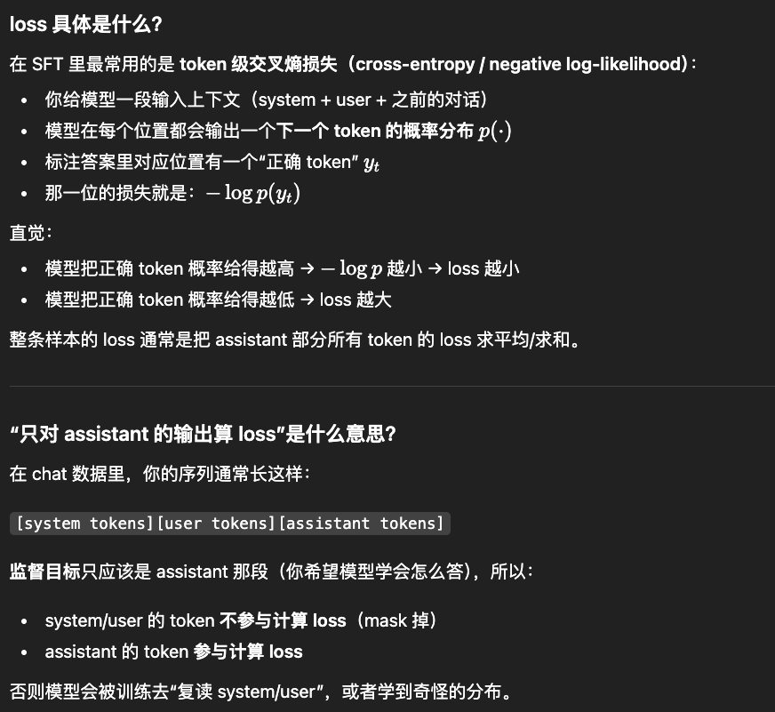

## 二. RLHF - Reinforcement Learning from Human Feedback
### 1. PPO - Proximal Policy Optimization
**重要性采样比例r_t：**
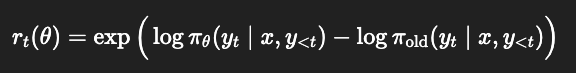
- 如果新模型给这个动作的概率 比旧模型更大 → 𝑟_𝑡>1
- 如果新模型给这个动作的概率 更小 → 𝑟_𝑡<1
- 策略π：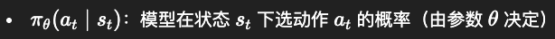
- *ps:* 第一次更新前，需要把π_ref赋值给π_sita，在算到PPO-clip后，做反向传播，才能更新π_sita的参数；更新后，再把π_sita的参数赋值给π_ref，进入下一轮迭代。

**优势函数A_t:**
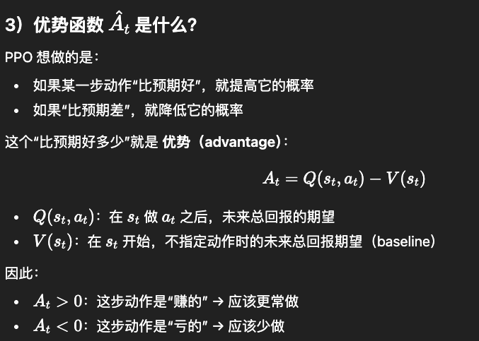
- 实际训练里用估计值 `𝐴^𝑡（比如用 GAE）`

**GAE(Generalized Advantage Estimation):**
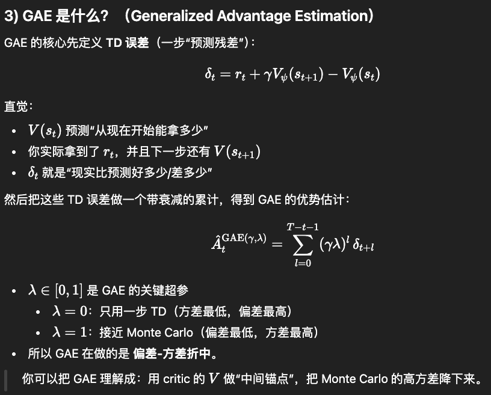
- 序列奖励`R(x,y)` -> 每步奖励`r_t` ➕ critic`V` -> 获得优势`A_t` -> 用PPO-clip更新策略π
- `r_t`：第 t 步拿到的即时奖励（每步奖励）, 由下面两部分组成：
- 1) 每个 token 都有一个 KL 惩罚（通常是负的）
- 2) 在最后一步（EOS）再加上奖励模型给的整段分数（终端奖励）

**critic V:**
Value model(Critic)需要和Policy model一起训练。
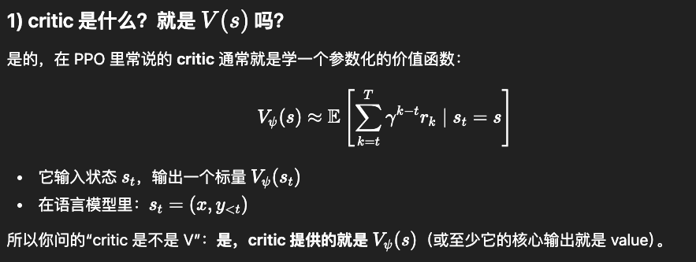
- critic学的就是优势函数中的价值函数`V(s)`，用来估计状态s的价值，进而计算优势`A_t = G_t - V(s_t)`
- critic 提供 baseline（以及 bootstrap），用来计算 advantage；advantage 决定 policy 更新方向；policy 反过来生成数据给 critic 学。
- critic 也要训练：critic的loss是：

**PPO-clip目标:**
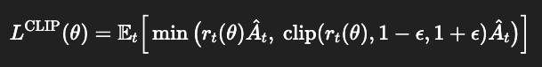
- 训练时我们最大化 `L^CLIP`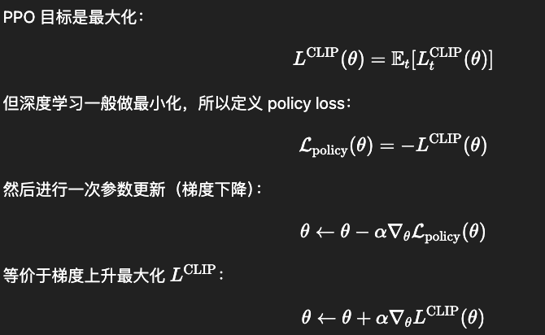

**PPO-RLHF 的优化目标：即最大化序列奖励R(x,y)**
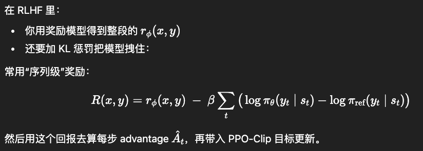
- R(x,y)里面包含一个RM+一个KL惩罚
- 目标是：最大化R(x,y)，也就是最大化RM的奖励，同时最小化KL惩罚（保持新模型和旧模型的行为相似）

**RM(Reward Model)的训练：**
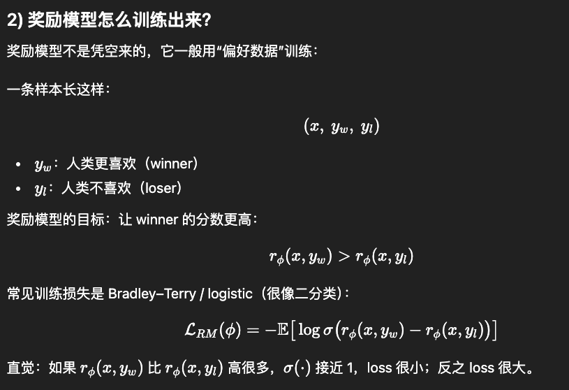

**一次 PPO 训练迭代（iteration）通常包含：采样 → 计算奖励/优势 → PPO 更新。**
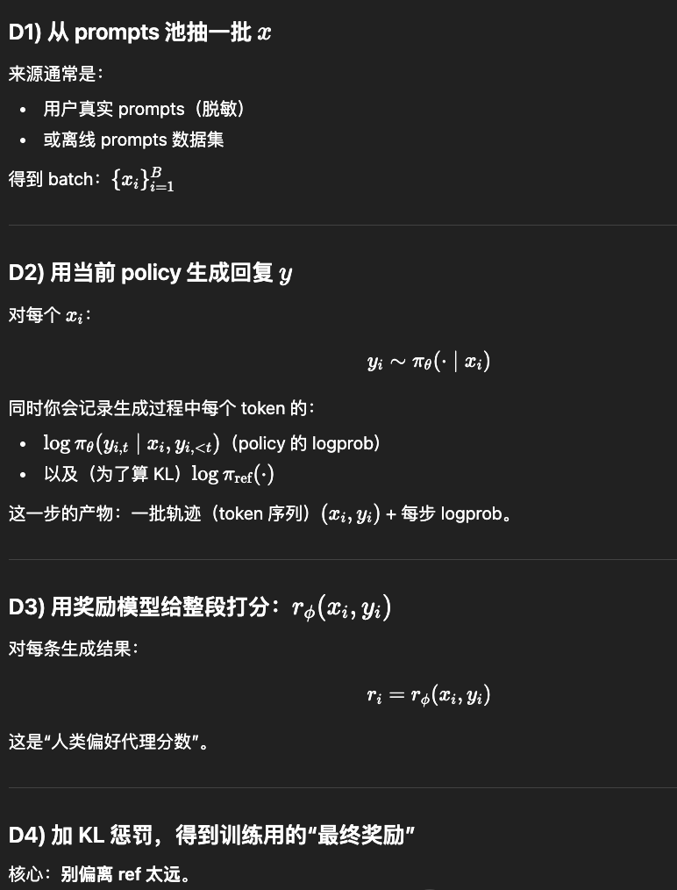
- KL惩罚：常用 token-level 近似（即：image-3的KL惩罚）
- 序列奖励：
$$R(x,y)= r_\phi(x,y)\ -\ \beta\sum_t\big(\log \pi_\theta(y_t\mid s_t)-\log \pi_{\text{ref}}(y_t\mid s_t)\big)$$

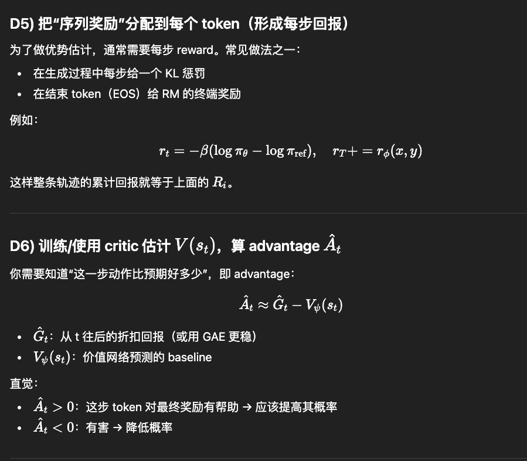
- 把“序列奖励”R(x,y)分配到每个 token（形成每步回报）, 每步计算出的奖励回报被用来计算优势`A_t`中的`G_t`值
- 也可以用`GAE`而不是算`G_t`

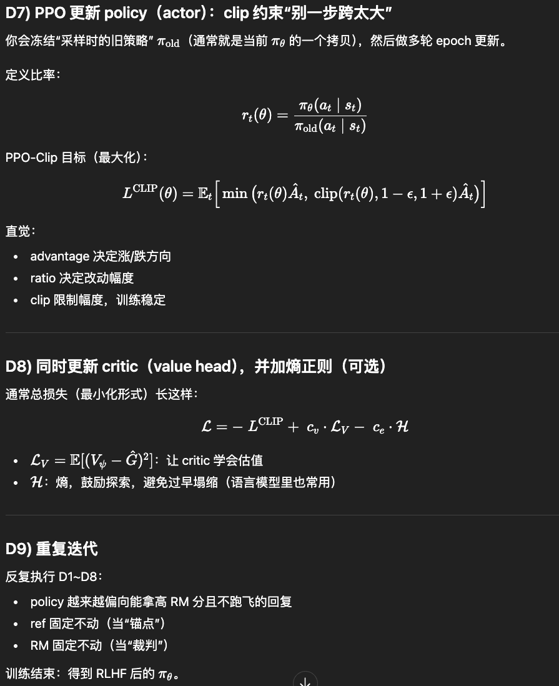
- **PPO更新:** 不是每算出一个A_t就更新一次，而是先把一批轨迹里所有token的`A_t`都算出来，然后把它们一起放进 PPO-clip 目标里做一次（或多次 epoch 的）批量更新。


**RHLF-PPO的总loss是：**
$$\mathcal{L}_{\text{total}}= -L^{\text{CLIP}}+c_v \mathcal{L}_V-c_e \mathcal{H}$$
* 第一项：$-L^{\text{CLIP}}$（等价于最大化 $L^{\text{CLIP}}$,这是PPO-clip的目标）
* 第二项：value loss（最小化）
* 第三项：熵项（最大化熵，所以写成减号）

### 2. DPO - Direct Preference Optimization
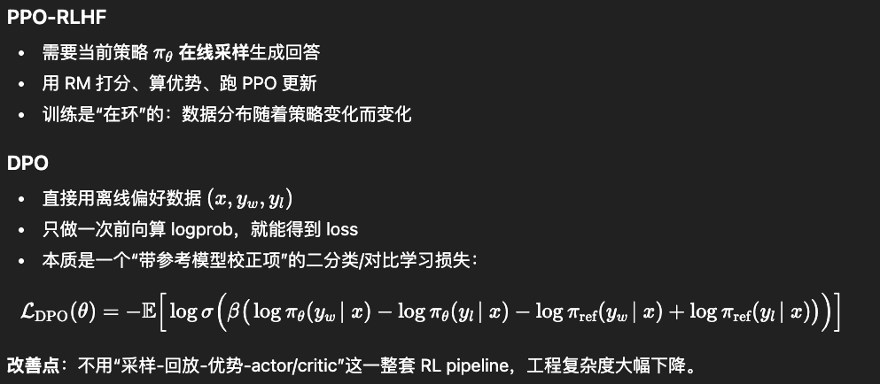
- 其中σ是sigmoid函数

**DPO比PPO更稳定：**
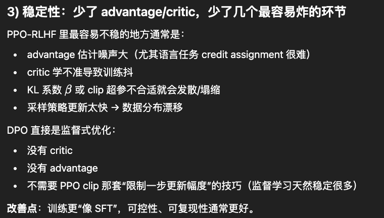


### 3. GRPO - Group Relative Policy Optimization
**GRPO和PPO的区别：**
1. GRPO和PPO的最大区别在于对优势函数的估计上，GRPO没有使用critic模型(但使用了奖励模型RM)来估计优势函数(Advantage)，而是对大语言模型中采样了多个返回
2. 输入不同：`PPO`的是从 prompt 数据集里抽一批 prompts，每个输入对应一个输出；`GRPO`则是从 prompt 数据集里抽一批 prompts，每个输入对应多段输出（比如4段）。
3. GRPO-Zero 是GRPO的一个变体，GRPO-Zero在GRPO的基础上去掉了奖励模型RM，直接使用基于规则的奖励函数
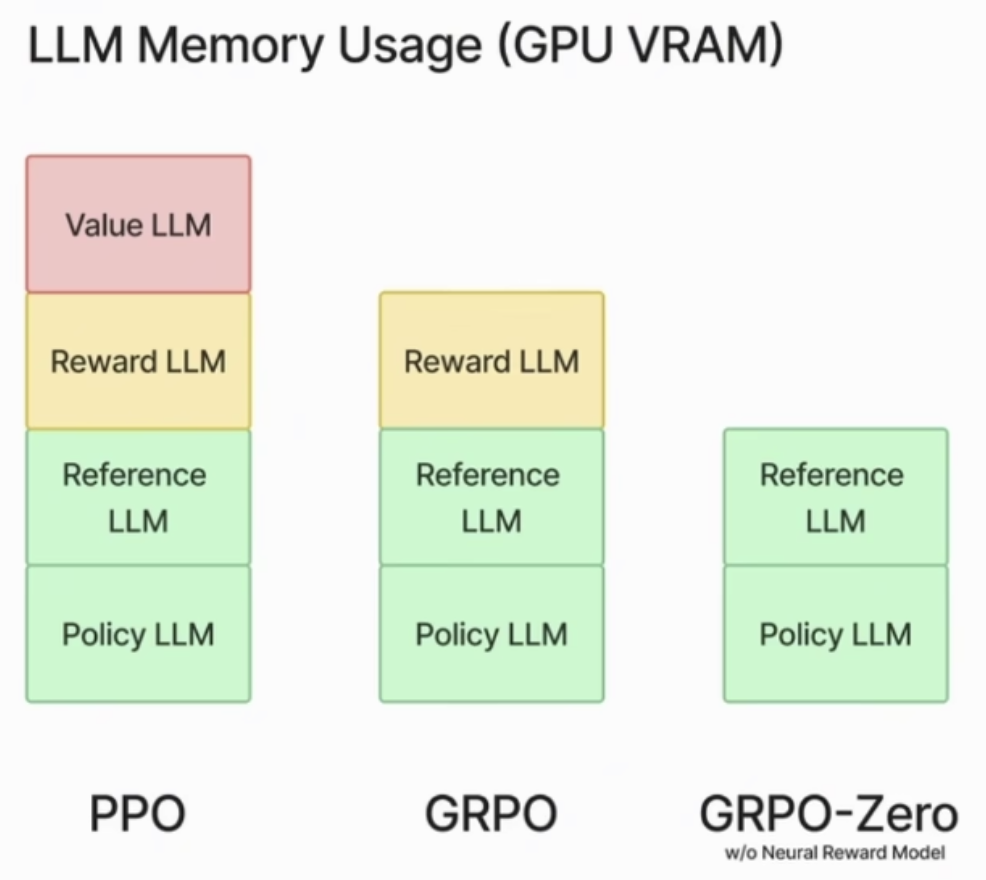

**GRPO得到优势函数的大致步骤： （KL和PPO一致）**
*一个 prompt，采样多个回答，在组内比较谁更好，再据此更新策略。*
- 1. 输入一段prompt(x)，采样几段输出(y)，得到多段输出序列(假如有四段输出)
- 2. 对多段输出序列进行打分，得到一个分数序列(score)（四个值）
- 3. 对分数序列减去均值/标准差得到优势函数(Advantage)的估计值（四个归一化的值）

**GRPO-loss:**
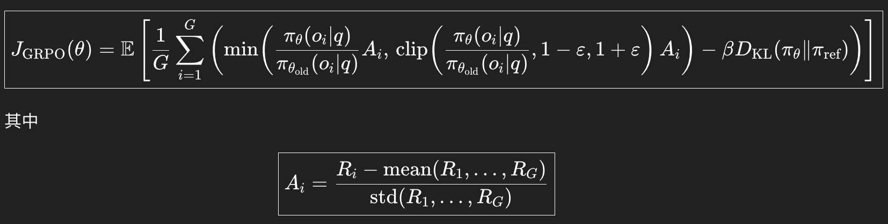
- loss = -J_GRPO
