# Chapter 3：Transformer 模型讲解

transformer 的输入是形状为（B，T）的ID序列，(B, T) 这个张量的每个元素就是一个 token ID。
- B 是 batch size, 代表有多少个句子
- T 是 sequence length, 代表每个句子有多少个 token

(B, T) 这个张量经过 embedding 层后会变成 (B, T, D)，其中 D 是 embedding 的维度。

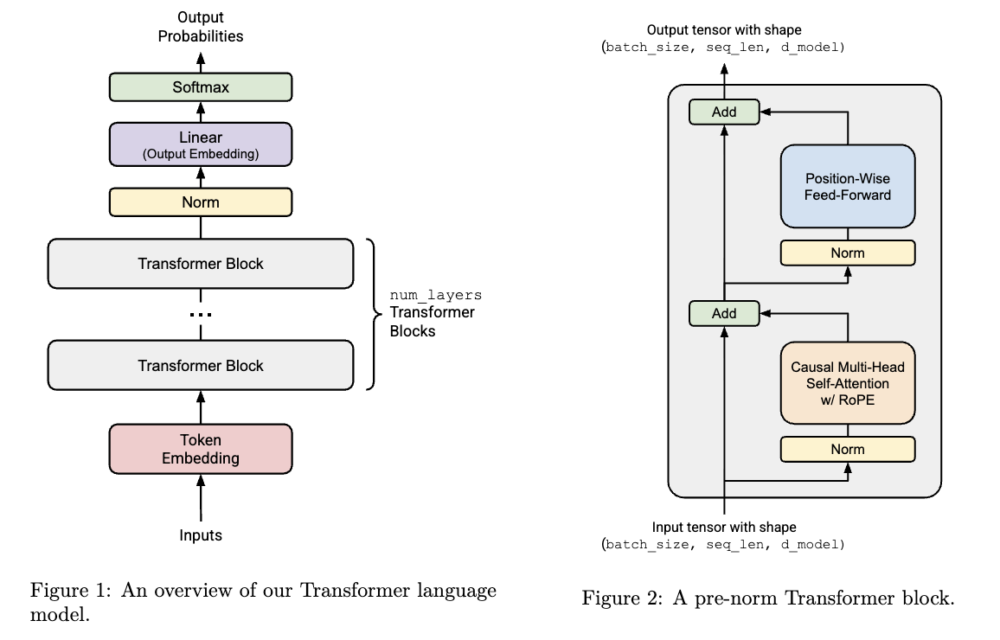
---

### 3.1.1 Token Embedding
给定一个令牌 ID 序列，Transformer 语言模型通过`Token Embedding`层生成一系列向量。每个嵌入层接收一个形状为`（batch_size, sequence_length）`的整数张量，并输出形状为`（batch_size, sequence_length, d_model）`的向量序列。

### 3.1.2 Pre-norm transformer block
每个 Transformer 块接收形状为`(batch_size, sequence_length, d_model)`的输入，并返回形状为`(batch_size, sequence_length, d_model)`的输出

## 3.2 Output Normalization and Embedding 
作用：提取最终激活值并将其转换为词汇表上的概率分布。

## 3.3 Batching, Einsum and Efficient Computation
详见einstein_example

### 3.3.1 数学符号与内存顺序
**行向量**
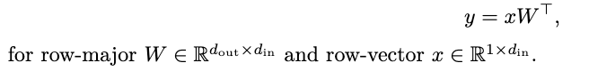
- 用`行向量`来定义矩阵

**列向量**
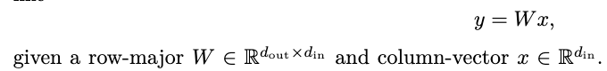
- 用`列向量`来进行数学表示

**注意：** W的形状始终为`(d_out, d_in)`
可以用：`einsum(x, W, "... d_in, d_out d_in -> ... d_out")`来实现矩阵乘法，`y=x@W.T=W@x`

## 3.4 基础模块构建：Linear 和 Embedding 模块
### 3.4.1 参数初始化
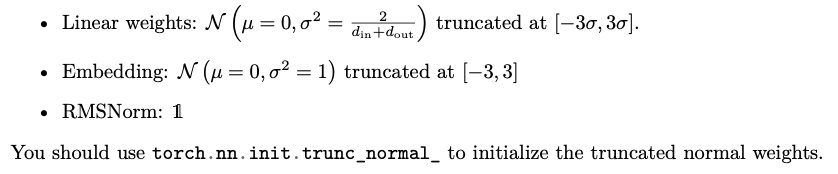
Pytorch 实现：
- `weight1 = torch.empty(d_in, d_out)`
- `nn.init.trunc_normal_(weight1, mean=0, std=std, a= -3*std, b= 3*std)`       末尾带下划线的函数 = 原地操作 (in-place)


### 3.4.2 Linear 模块
实现一个继承自 torch.nn.Module 的自定义 Linear 类，用于执行线性变换：
`y = W @ x`

**参数**
`nn.Parameter` 是一种特殊的 Tensor：
只要它是 Module 的属性，它就会被自动当作“可训练参数”注册。
例如: `self.W = nn.Parameter(...)`
- `self.W` 会出现在 `self.parameters()`
- 优化器会更新它（如果它参与 loss 的反向传播）
- `state_dict()` 会保存它
- `load_state_dict()` 能加载它  # load_state_dict()的参数应该是一个字典 key:参数名，value:参数值


### 3.4.3 Embedding 模块
**作用:** 是根据输入的 token ID，在 embedding 矩阵中索引出对应的向量 (做索引查表)
`Y = W[x]`
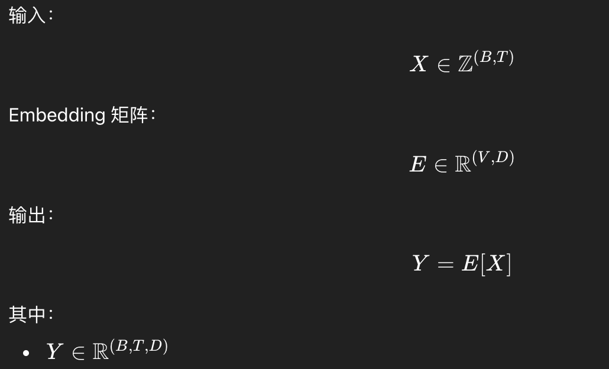


## 3.5 Pre-Norm Transformer 块
**组成：** 一个多头自注意力机制和一个逐位置前馈网络

### 3.5.1 Root Mean Square Layer Normalization (RMSNorm)
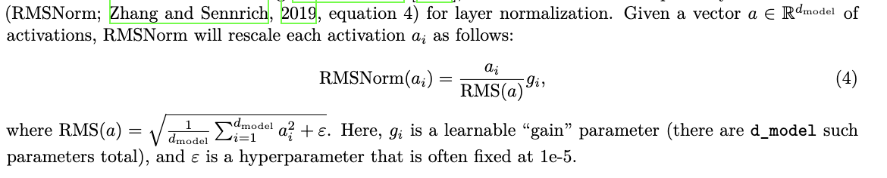
`a` 是 单个 token 的 hidden vector (`d_model`)，`g_i`有`d_model`个
公式里面是逐元素乘(`*`)：$RMSNorm(a)=\frac{a}{RMS(a)}*g$

Pytorch实现：
- `(x ** 2).mean(dim=-1, keepdim=True)`   # 用来算均方
- `torch.sqrt()`     # 而不是math.sqrt

*ps:*
为防止输入平方时发生溢出，您应将输入转换为 torch.float32 类型。(在forward里面修改dtype，但注意要改回原dtype)


### 3.5.2 Position-Wise FFN
采用：SwiGLU+丢弃bias项
- **Swish激活函数**
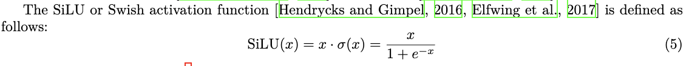

- **GLU门控**
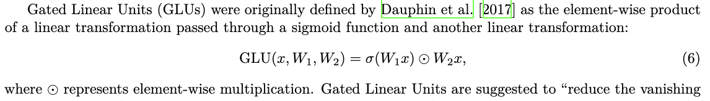
采用：**逐元素相乘**

- **SwiGLU**
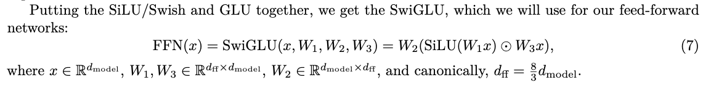


### 3.5.3 Rotary Positional Embeddings(RoPE)
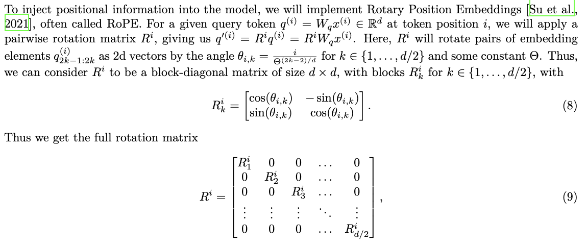
- R矩阵中的`0`表示2x2的零矩阵
- 如需优化，可采用所有层共享的单一 RoPE 模块，并在初始化时通过 `self.register_buffer(persistent=False)`创建包含 2d 个预计算正弦/余弦的缓冲区（而非 nn.Parameter，因为这些固定的余弦/正弦值无需学习）

**这个 RoPE 层没有可学习参数**
*每一对维度的旋转角度 $\theta_{i,k}$：*
$\theta_{i,k}=\frac{i}{\Theta^{(2k-2)/d}}\quad, k \in {1,\dots,d/2}$

可以把它理解成：
* `i`：当前位置（第几个 token）
* `k`：第几对维度（第 1 对、第 2 对…）
* $\Theta$ ：一个常数（实际实现里通常取 10000）
* max_seq_len：序列长度，通常取2048

*ps：*
不要构造 d×d 旋转矩阵，而是用`self.register_buffer("cos", cos_tensor, persistent=False)`来构造缓冲区变量


### 3.5.4 Scaled Dot-Product Attention
1. softmax
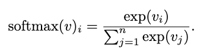
可以加入一个常数来避免导数过大，(`softmax(v)=softmax(v−c)`), 取`c=max(v)`
处理细节：
    - 对 dim 维度做 softmax
    - 输出 shape 不变
    - 该维度变成概率分布
    - `c = reduce(x, "... dim -> ... 1", "max")`和`reduce(torch.exp(x - c), "... dim -> ... 1", "sum")`

2. 缩放点积注意力
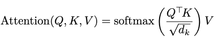
这里的维度是：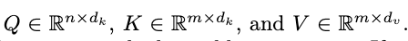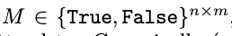其他地方是：Q @ K.T
- 应用掩码（如果是False，则替换成-inf）：`scaled_dot_product = scaled_dot_product.masked_fill(~mask, float("-inf"))`
- 这里应用softmax应该对`key进行softmax`，维度是`dim=-1`，即对每个query对应的所有key进行softmax。因为：每个 query 对所有 key 产生一个概率分布

### 3.5.5 Multi-Head Attention
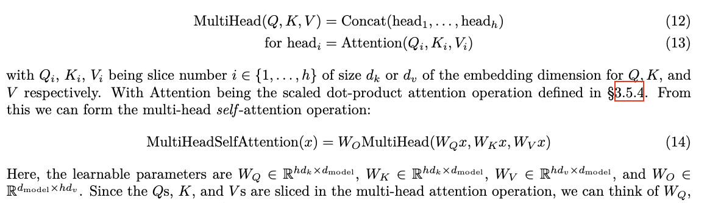
`其中：` dk = dv = dmodel/h
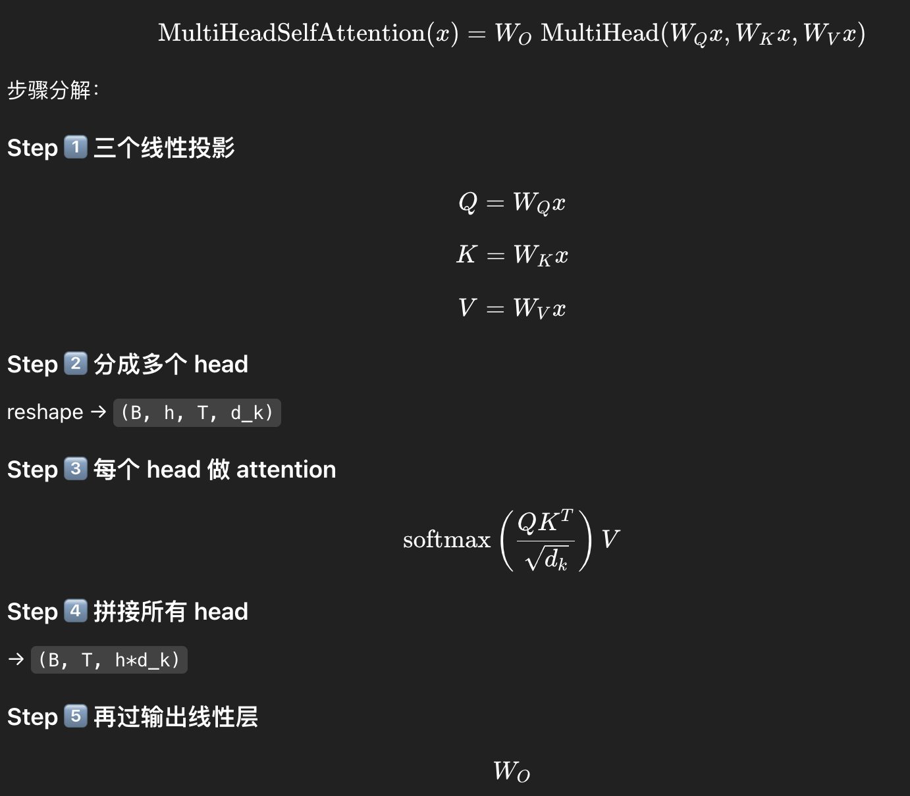
1. 加入因果掩码： mask矩阵允许j≤i，禁止j>i（即禁止未来信息）
例如：mask=
[ [T F F F]
 [T T F F]
 [T T T F]
 [T T T T] ]
pytorch实现：`torch.tril()`的作用：保留下三角（含对角线），上三角全部变成 0（False）
`causal = torch.tril(torch.ones(max_seq_len, max_seq_len, dtype=torch.bool, device=device))`
`self.register_buffer("causal_mask", causal, persistent=False)`

2. 加入`RoPE`：在计算注意力分数之前，对 Q 和 K 应用 RoPE 旋转。 
RoPE应该应用到：reshape 成多头: `(..., seq, d_model) -> (..., h, seq, d_k)` 之后的QK，
而此时RoPE参数中的d_k， 不是d_model， 而是d_model/num_heads


## 3.6 完整的 Transformer 语言模型
测试里面不需要加最后的`softmax`，且`output embedding`层是线性层


# Chapter 4: 训练 Transformer
## 4.1 Cross-entropy loss
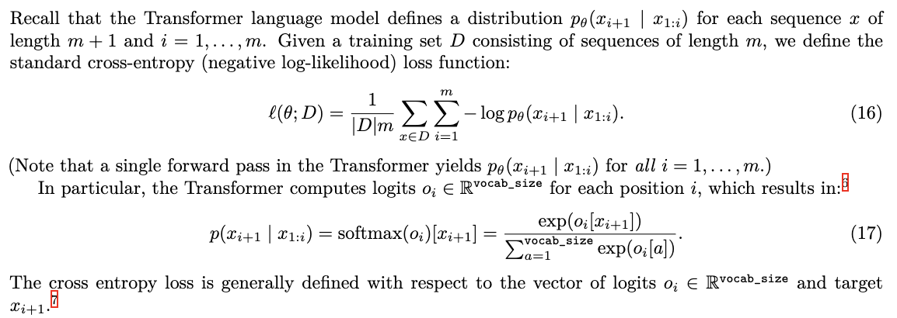
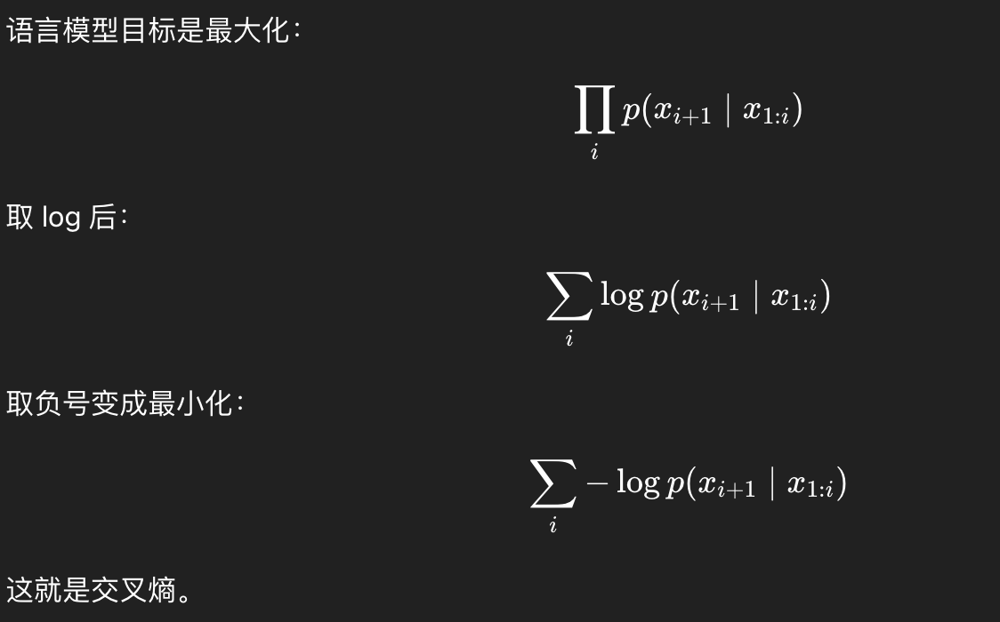
**注意：**
$p_i = \text{softmax}(o_i)[x_{i+1}]$意思是：
取第 i 行 softmax 输出向量中的第 $x_{i+1}$ 个元素
即：
* $o_i$ 是第 i 个样本的 logit 向量
* softmax$(o_i)$ 是一个长度为 V 的概率向量
* $x_{i+1}$ 是一个整数（类别编号）
* 我们要取这个编号对应的概率
```python
probs = self.softmax(inputs)    # [batch_size, vocab_size]
# 用“高级索引”取正确类别概率
batch_indices = torch.arange(inputs.size(0), device=inputs.device)      # [batch_size]
p = probs[batch_indices, targets]   # 取每一行第 targets[i] 列；    shape: [B]

# probs[i]       = 第 i 个样本的概率分布（长度 V）
# targets[i]     = 正确类别的编号
# probs[i][targets[i]] = 正确类别的概率

# clamp_min(eps) 防止 log(0),将张量中的元素限制在一个最小值之上
return -torch.log(p.clamp_min(eps)).mean()
```


## 4.2 The SGD Optimizer
官方实现
```python
from collections.abc import Callable, Iterable
from typing import Optional
import torch
import math

class SGD(torch.optim.Optimizer):
    def __init__(self, params, lr=1e-3):
        if lr < 0:
            raise ValueError(f"Invalid learning rate: {lr}")
        defaults = {"lr": lr}
        super().__init__(params, defaults)

    def step(self, closure: Optional[Callable] = None):
        loss = None if closure is None else closure()
        for group in self.param_groups:
            lr = group["lr"] # Get the learning rate.
            for p in group["params"]:
                if p.grad is None:
                    continue
                state = self.state[p] # Get state associated with p.
                t = state.get("t", 0) # Get iteration number from the state, or initial value.
                grad = p.grad.data # Get the gradient of loss with respect to p.
                p.data -= lr / math.sqrt(t + 1) * grad # Update weight tensor in-place.
                state["t"] = t + 1 # Increment iteration number.
        return loss
```

训练loop
```python
weights = torch.nn.Parameter(5 * torch.randn((10, 10)))
opt = SGD([weights], lr=1)

for t in range(100):
    opt.zero_grad() # 清空上一步的梯度
    loss = (weights**2).mean() # 前向算 loss（标量）
    print(loss.cpu().item())
    loss.backward() # 反向传播，把梯度写到每个参数的 p.grad
    opt.step() # Run optimizer step.
```

## 4.3 The AdamW Optimizer
AdamW 对 Adam 进行了改进，通过添加权重衰减（在每次迭代中将参数向 0 方向收缩）来提升正则化效果。
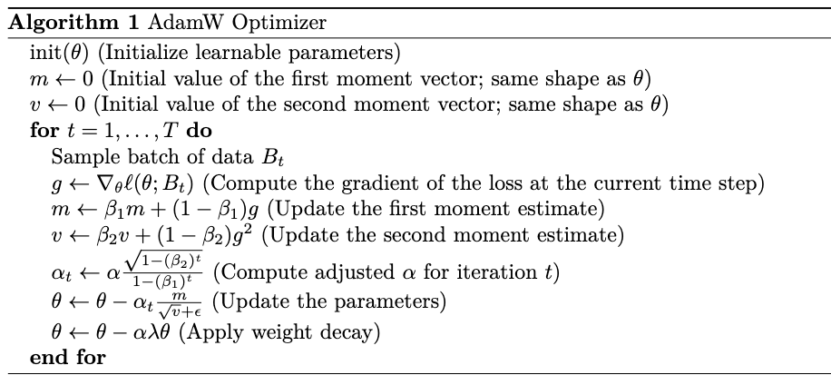
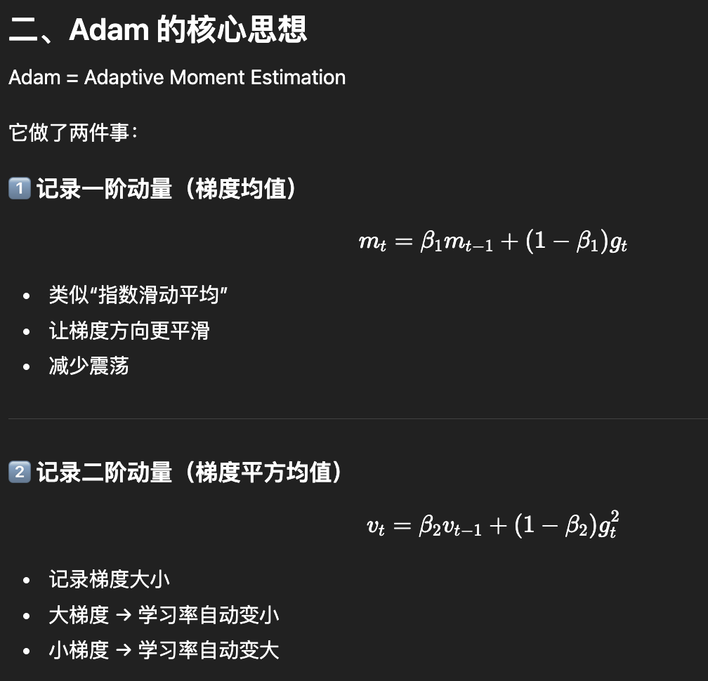
核心思想是：记录一阶动量（梯度均值）和二阶动量（梯度平方的均值），并使用它们来调整每个参数的学习率。
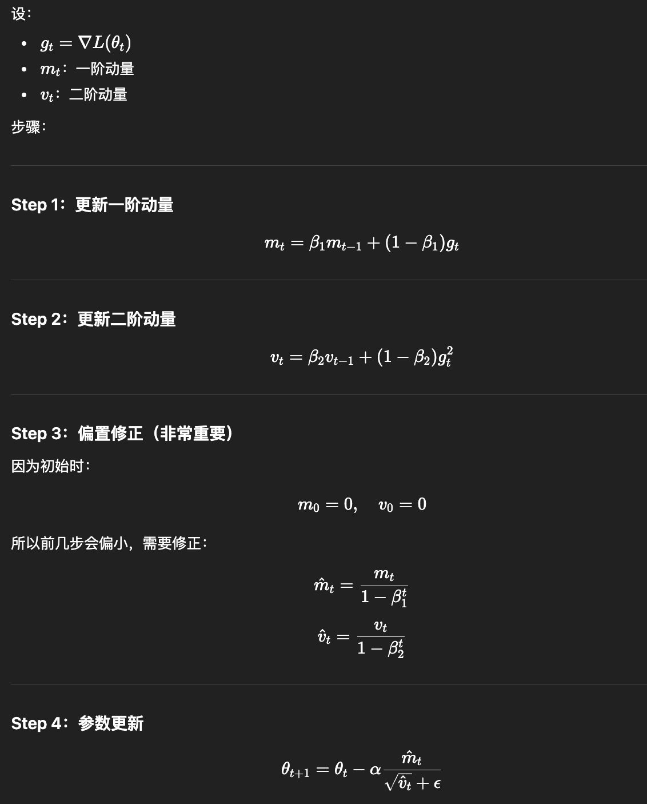
学习率 `α` 也是会更新的
`β1、β2​` 设为 (0.9, 0.999)
`ϵ` 是一个很小的值（例如 10⁻⁸`1e-8`） 用于在 v 中出现极小值时提高数值稳定性(防止÷0)

*ps：*
这里的`偏置修正m，v`等价于`修正学习率α`


# QA
## (a)
考虑 GPT-2 XL，其配置如下：
* 词表大小（vocab_size）：50,257
* 上下文长度（context_length）：1,024
* 层数（num_layers）：48
* 隐藏维度（d_model）：1,600
* 注意力头数（num_heads）：25
* 前馈层维度（d_ff）：6,400

如果我们按照这个配置构建模型：
1. 模型共有多少个可训练参数？
2. 假设每个参数用单精度浮点数（FP32）表示，仅加载模型需要多少内存？
---
## (b)
列出完成一次前向传播所需的矩阵乘法，并计算总 FLOPs。
假设输入序列长度为 context_length。
---
## (c)
根据上面的分析，模型中哪一部分消耗最多 FLOPs？
---
## (d)
对 GPT-2 small / medium / large 重复上述分析。
随着模型变大，哪些部分在总 FLOPs 中占比增加或减少？
---
## (e)
如果将 GPT-2 XL 的 context_length 提高到 16,384，会发生什么变化？
总 FLOPs 如何变化？各组件占比如何变化？
---

# (a) 参数量与显存
### 单层参数量
每层包括：
### 1️⃣ Attention
Q/K/V/O 四个投影：
$$
4 \cdot d_{model}^2= 4 \cdot 1600^2= 4 \cdot 2.56M=10.24M
$$
### 2️⃣ FFN
$$
2 \cdot d_{model} \cdot d_{ff}== 2 \cdot 1600 \cdot 6400= 2 \cdot 10.24M=20.48M
$$
### 3️⃣ RMSNorm
每层两个：
$$
2 \cdot 1600\approx 3.2K
$$
忽略不计。
---
### 每层总参数：
$$
10.24M + 20.48M \approx 30.72M
$$
---
### 48 层：
$$
48 \cdot 30.72M\approx 1.475B
$$
---
### Embedding
$$
50257 \cdot 1600\approx 80.4M
$$
---
### LM Head（若 untied）：
$$
80.4M
$$
---
### 总参数量（近似）
$$
1.475B + 160M\approx 1.64B
$$
---
### 显存需求（FP32）
每参数 4 字节：
$$
1.64B \cdot 4\approx 6.6 GB
$$
---
## ✅ (a) 简答
GPT-2 XL 约有 1.6B 参数，FP32 加载需要约 6–7GB 显存。
---
# (b) Forward FLOPs
设：
$$
L = 1024, \quad d=1600, \quad h=25
$$
---
## 每层 FLOPs
### 1️⃣ QKV 投影
$$
3 \cdot L \cdot d^2=3 \cdot 1024 \cdot 1600^2\approx 7.86B
$$
---
### 2️⃣ Attention score
$$
L^2 \cdot d=1024^2 \cdot 1600\approx 1.68B
$$
---
### 3️⃣ Attention × V
同上：
$$
\approx 1.68B
$$
---
### 4️⃣ Output projection
$$
L \cdot d^2\approx 2.62B
$$
---
### 5️⃣ FFN
$$
2 \cdot L \cdot d \cdot d_{ff}= 2 \cdot 1024 \cdot 1600 \cdot 6400\approx 20.97B
$$
---
### 单层总 FLOPs
$$
\approx 35B
$$
---
### 48 层
$$
48 \cdot 35B\approx 1.68T FLOPs
$$
---
## ✅ (b) 简答
一次 forward 约需 **1.7 TFLOPs**。
---
# (c) 哪部分最多？
FFN 占：
$$
~60%
$$
因为：
$$
O(L d d_{ff})
$$
远大于 attention 的：
$$
O(L^2 d)
$$
（在 L=1024 时）
---
## ✅ (c) 简答
FFN 是 FLOPs 最大来源，占约 60%。
---
# (d) 不同模型规模
当 d_model 增大：
* attention FLOPs ∝ d²
* FFN FLOPs ∝ d·d_ff ∝ d²
两者都二次增长
但：
* attention score ∝ L²d
* FFN ∝ Ld²
当 d ↑ 时
$$
Ld^2 \gg L^2 d
$$
所以：
👉 模型越大，FFN 占比更高
👉 attention score 相对占比下降
---
## ✅ (d) 简答
随着模型变大，FFN 的 FLOPs 占比增加，attention score 的占比下降。
---
# (e) context_length = 16,384
注意：
* projection FLOPs ∝ L
* FFN FLOPs ∝ L
* attention score ∝ L²

当 L 提高 16 倍：
* projection/FFN ×16
* attention score ×256
---
## 结果
attention score 变成主导项。
---
## ✅ (e) 简答
总 FLOPs 约增长 16 倍（主项为 Ld²），但 attention score 的 L² 项增长 256 倍，因此长序列时 attention 成为主导计算。
---
# 🎯 总结
| 项目     | 主导计算               |
| ------ | ------------------ |
| 增大模型宽度 | FFN 主导             |
| 增大序列长度 | Attention score 主导 |
---

