# 第一个视频 —— tokenizer
1. **Tokenizer**的作用是：将string转换成sequence of integers
2. **character-based、byte-based、word-based tokenization**的区别：word 看“词”，char 看“字”，byte 看“内存里的字节”；现代 LLM 多用 byte + BPE。
3. **BPE**的作用是：通过统计词频，将词进行分词，并生成vocab，添加到词典中
4. **作业一要求**：先使用word-based tokenizer把文本切成初始segment，然后在每一个segment内部运行原始的 BPE 算法。(string -> word -> byte(utf-8) -> BPE)


# 第二个视频 —— Pytorch + 资源计算
总FLOPs需求≈6✖️训练用 Token 数✖️模型参数量
## 1. Memory
**tensor: 浮点数精度**
| 格式 | 位宽 | 指数位 | 尾数位 | 范围 | 精度 | 训练稳定性 |
| --- | --- | --- | --- | --- | --- | --- |
| FP32 | 32 | 8 | 23 | 大 | 高 | ⭐⭐⭐⭐⭐ |
| FP16 | 16 | 5 | 10 | 小 | 中 | ⭐⭐ |
| BF16 | 16 | 8 | 7 | 大 | 低 | ⭐⭐⭐⭐ |
| FP8 | 8 | 4/5 | 3/2 | 很小 | 很低 | ⭐ |

**所需的内存 = (param数量 + 激活数量(取决于batch_size和sequence_length) + gradient数量 + optimizer状态数量) ✖️ 每个数的字节数**


## 2. Compute
**einops: 更直观的tensor操作**
1. einsum(求和)
2. reduce(降维)
3. rearrange(重排／拆分／合并)

## 3. FLOPs - Floating Point Operations
由矩阵乘法主导
FLOPs = 2 * 参数数量 * 序列长度(token数)
**总结：** BxD 矩阵与 DxK 矩阵相乘，FLOPs = 2 * B * D * K

*FLOPs估算示例：线性模型*
eg: 数据的个数为 B、输入维度 D、输出维度 K 的线性映射(x=(B,D), w=(D,K), y=x@w)，其前向计算即一次批量矩阵乘法(x[i][j] * w[j][k])。每对 (i, j, k) 组合需执行一次乘法和一次加法，总 FLOPs 为**2×B×D×K**
*其中：* B为序列长度，(D K)为参数数量 -> FLOPs = 2 * 参数数量 * 序列长度

*多维情况* - 广播的维度看成batch即可
A：（d1，d2，d3，m,k）
B：（d1，d2，d3，k,n）
把前三维看成batch，每个 batch 做一次 m×k 乘 k×n 的矩阵乘法：
FLOPs = 2 * (d1 * d2 * d3) * m * k * n

## 4. FLOPS(FLOP/s) - 每秒浮点运算次数
速度：BF16 >> FP32
FLOPS = FLOPs / 时间(s)

## 5. MFU - Model FLOPs Utilization
MFU = 实际FLOPs / 理论FLOPs = 实际吞吐量 / 理论吞吐量
≥0.5: 就被认为是高效的模型并行实现

## 6. 梯度
反向传播时，计算每个参数的梯度需要的 FLOPs 大约是前向传播时的两倍。(需要两次矩阵乘法)
FLOPs(反向传播) = 4·B·#params
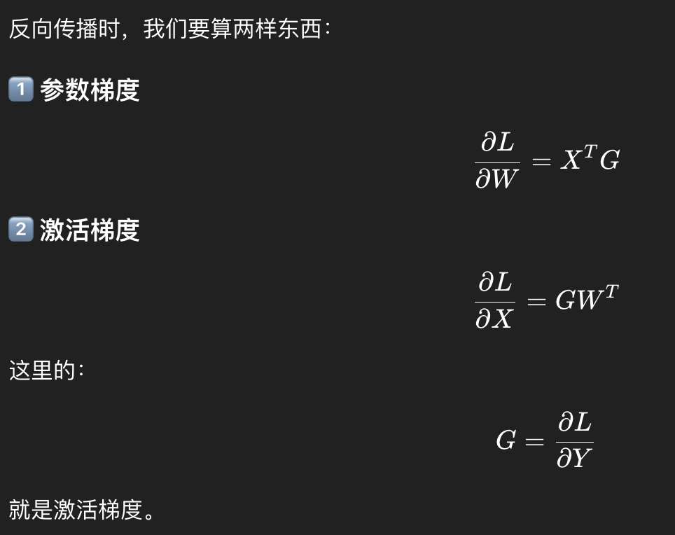
每一层都需要：
1. 用上游的激活梯度算自己的参数梯度
2. 再生成新的“激活梯度”往前传

## 7. load_data
data = np.memmap('data.npy', dtype=np.int16)

## 8. 优化器
1. Momentum = SGD + 指数平均梯度（仅一阶）；
2. AdaGrad = SGD + 对平方梯度的累积平均（仅二阶）；
3. RMSProp = AdaGrad + 对平方梯度的指数衰减平均；
4. Adam = RMSProp + Momentum（结合一阶与二阶信息）。
```python
# AdaGrad Optimizer
class AdaGrad(torch.optim.Optimizer):
    def __init__(self, params: Iterable[nn.Parameter], lr: float = 0.01):
        super(AdaGrad, self).__init__(params, dict(lr=lr))
    def step(self):
        for group in self.param_groups:
            lr = group["lr"]
            for p in group["params"]:
                # Optimizer state
                state = self.state[p]
                grad = p.grad.data
                # Get squared gradients g2 = sum_{i<t} g_i^2
                g2 = state.get("g2", torch.zeros_like(grad))
                # Update optimizer state
                g2 += torch.square(grad)
                state["g2"] = g2
                # Update parameters
                p.data -= lr * grad / torch.sqrt(g2 + 1e-5)
```

## 9. 检查点
```python
# Save the checkpoint:
checkpoint = {
    "model": model.state_dict(),
    "optimizer": optimizer.state_dict(),
}

torch.save(checkpoint, "model_checkpoint.pt")


# Load the checkpoint:
loaded_checkpoint = torch.load("model_checkpoint.pt")
```

## 10. 混合精度训练
1. 前向传播使用 `BF16, FP8`等低精度
2. 其余使用`FP32`等高精度

## 11. 课下练习
1. transformer模型的参数量、FLOPs计算:
https://zhuanlan.zhihu.com/p/624740065?s_r=0


# 第三个视频 —— 架构+超参数
## 一. transformer模型的变体
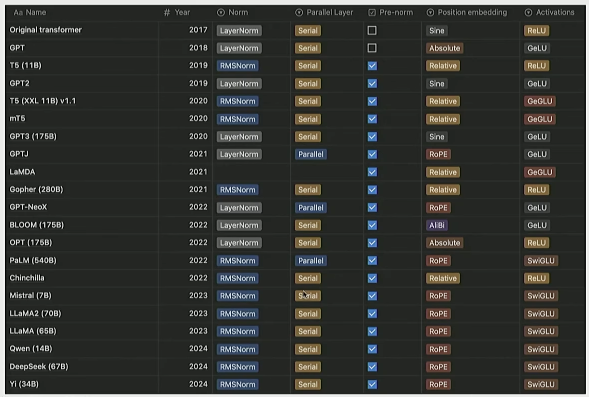

### 1. Pre-norm vs Post-norm
1. **Post-norm**: 先做残差连接，再做 LayerNorm
2. **Pre-norm**: 先做 LayerNorm，再做残差连接
**结论：** pre-norm 更稳定，尤其是深层模型；post-norm 可能导致训练不稳定，尤其是深层模型。
**原因：** 在深层 Transformer 里，核心原因就是——梯度更容易沿着残差路径“无损传播”，不容易爆炸或消失。
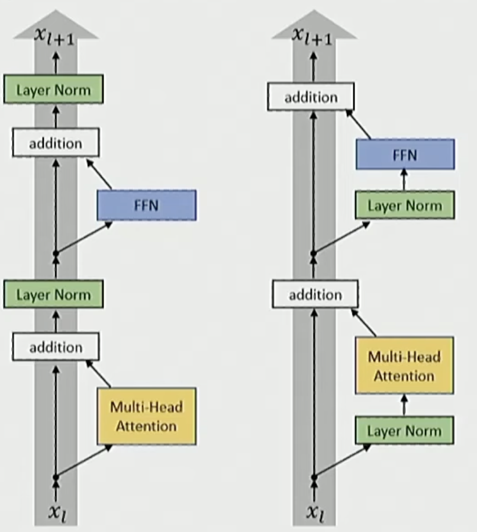
*ps*: 还有double_norm：LN + Fx + LN，然后残差连接。

### 2. LayerNorm vs RMSNorm
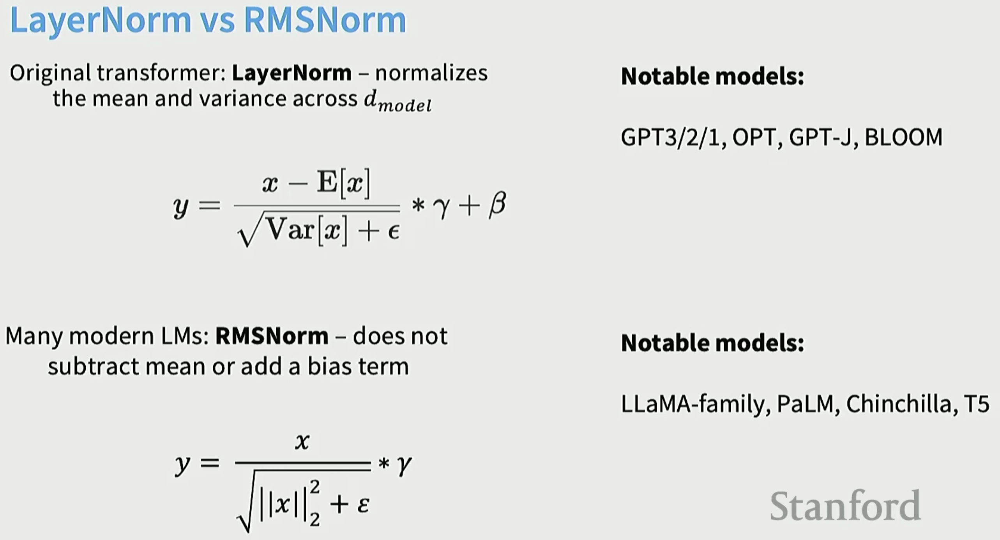
*ps*: 图里面RMS少了一个$\frac{1}{d}；$LN 和 RMSNorm 里的 x 是“单个 token 的 hidden vector”。不是整个 batch、不是整句、也不是整层矩阵。

1. **LayerNorm**: 对每个输入样本的所有特征进行归一化，计算均值和标准差，进行缩放和平移。
2. **RMSNorm**: 只计算均方根（RMS），不计算均值，进行缩放。
RMSNorm的公式为：$$\text{RMSNorm}(x) = \frac{x}{\sqrt{\frac{1}{d} \sum_{i=1}^{d} x_i^2 + \epsilon}} \cdot \gamma$$
二次范数的定义：$$||x||_2 = \sqrt{\sum_{i=1}^{d} x_i^2}$$
二次范数和RMS的关系：$$\text{RMS}(x) = \frac{||x||_2}{\sqrt{d}}$$

**结论：** RMSNorm 与 LN 在性能上相当，但 RMSNorm 更高效，尤其是在大规模训练下。
**原因：** RMSNorm 少一个减均值、少一个 β，减少了计算复杂度；在大规模训练下：hidden states 的均值往往接近0，减不减均值影响很小。

#### LN 和 BN 的区别
1. **LayerNorm**: 统计的是：单个样本、单个 token 内部的所有特征。在每个样本内部进行归一化，计算每个样本的均值和标准差，适用于RNN和Transformer等序列模型。
2. **BatchNorm**: 统计的是：跨 batch 的同一特征维度。在一个 mini-batch 内进行归一化，计算整个 mini-batch 的均值和标准差，适用于卷积神经网络（CNN）等图像模型。
**总结：** LN 更适合序列模型，BN 更适合图像模型。
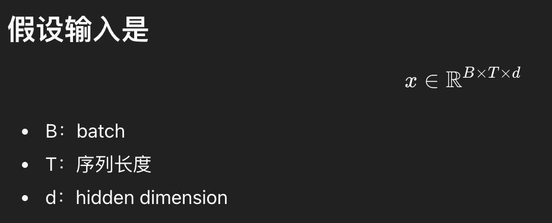
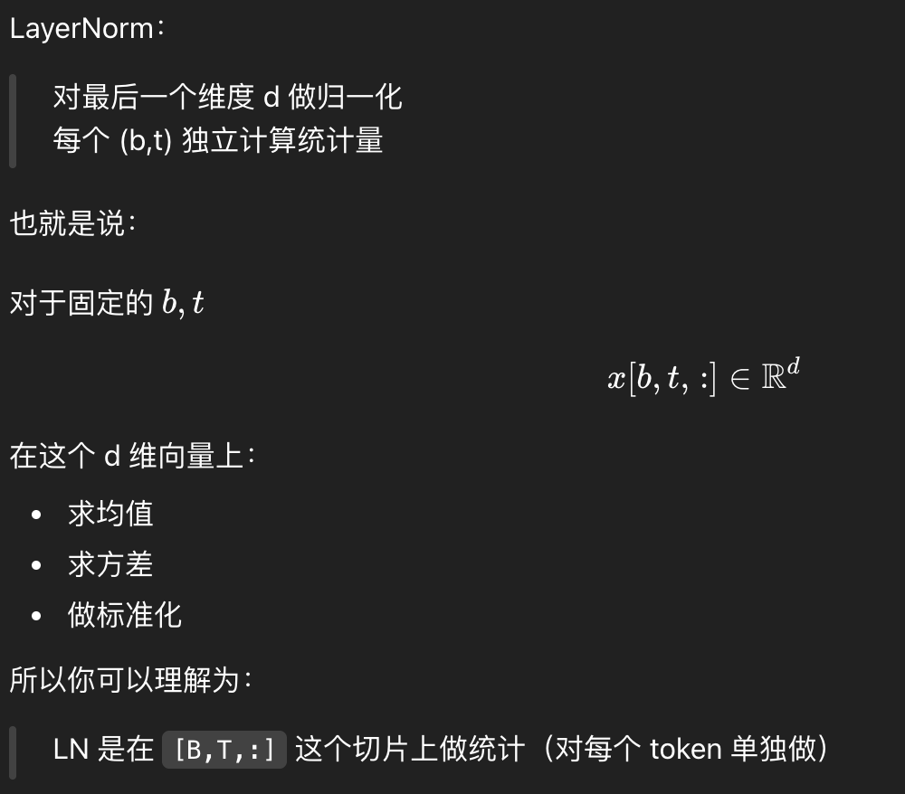
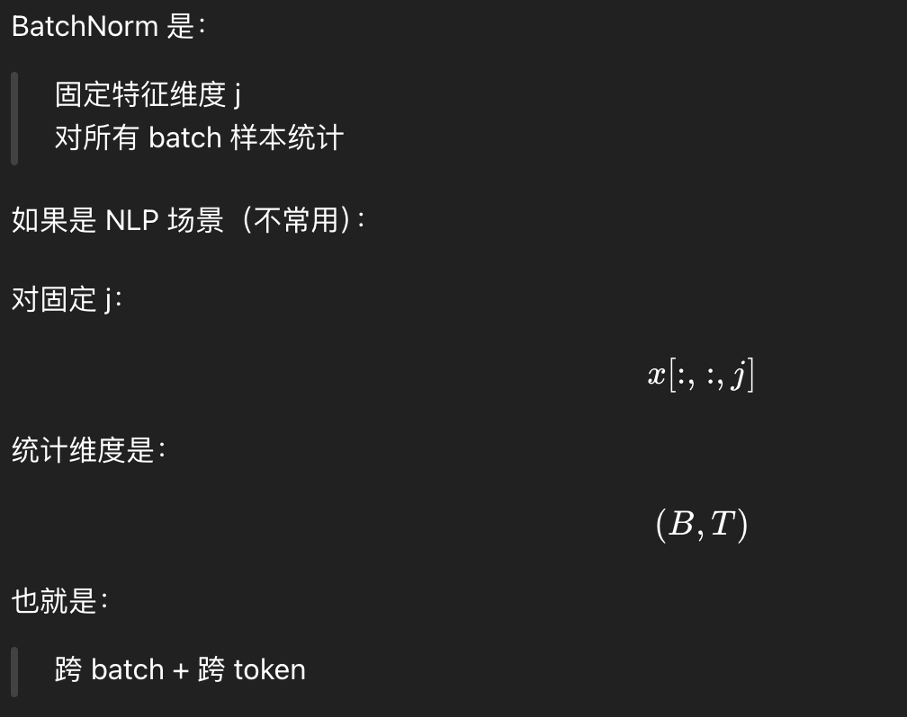


### 3. bias项的丢弃
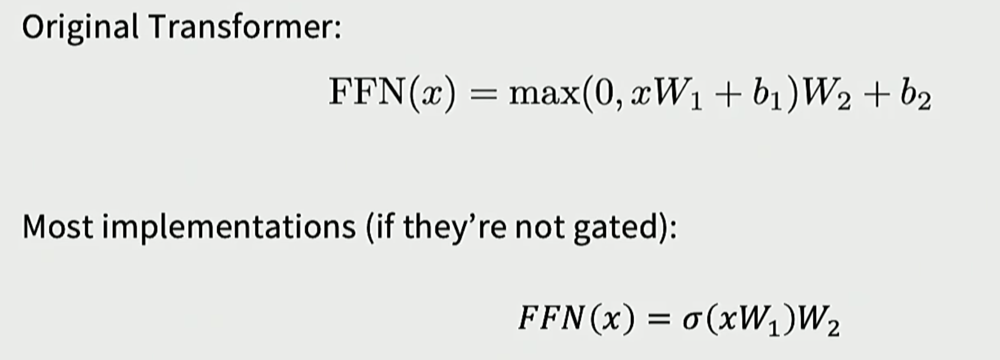

### 4. 激活函数 —— 在FFN中
1. **ReLU**: 输出为输入的正部分，负部分为0。
2. **GELU**: 解决了 ReLU 不可微分的问题。
3. **GEGLU**: 将输入分成两部分，一部分通过线性变换(xV - V是一个向量)，另一部分通过 GELU 激活函数，然后将两部分逐元素相乘。
4. **SwiGLU**: 结合了 Swish 激活函数和 GLU（Gated Linear Unit），在某些 Transformer 变体中表现更好。
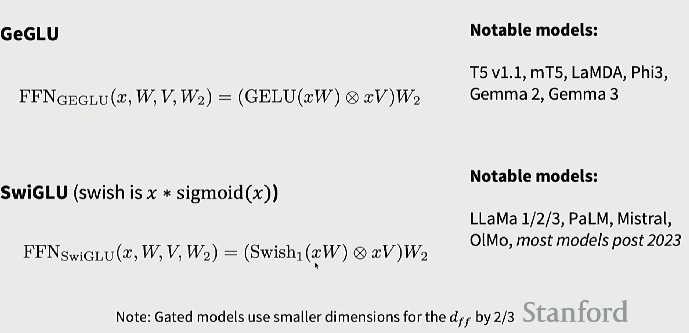
 
### 5. 串行化 vs 并行化
1. **串行化**: 传统transformer：先计算 attention，再计算 FFN，层与层之间是串行的。
2. **并行化**: 将 attention 和 FFN 的计算并行化，在同一层内同时计算 attention 和 FFN，然后将它们的输出进行融合（例如通过加权求和或拼接）。
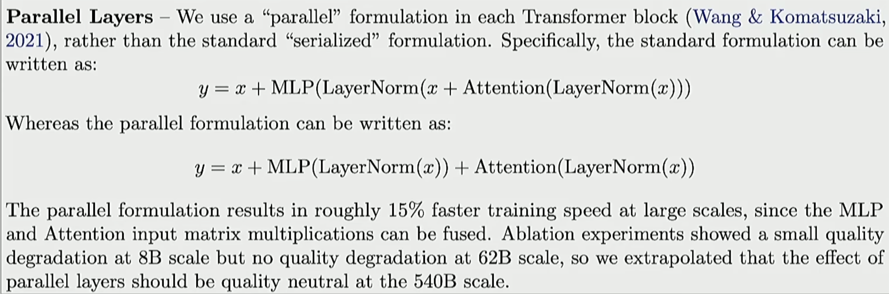

### 6. PE - Positional Encoding
x ：当前的 Token (词元)
i ：当前位置的索引
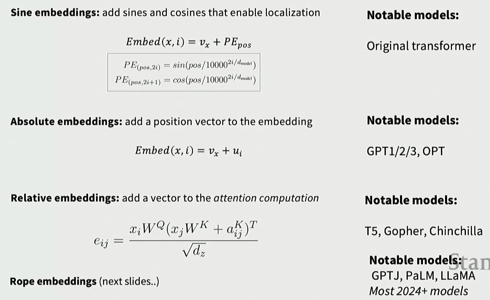
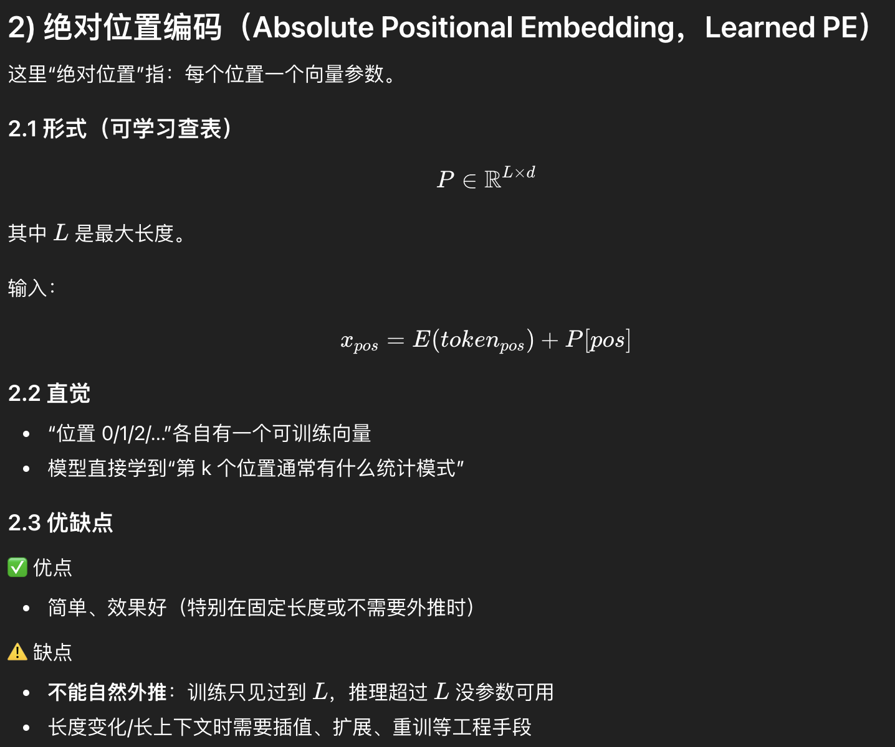
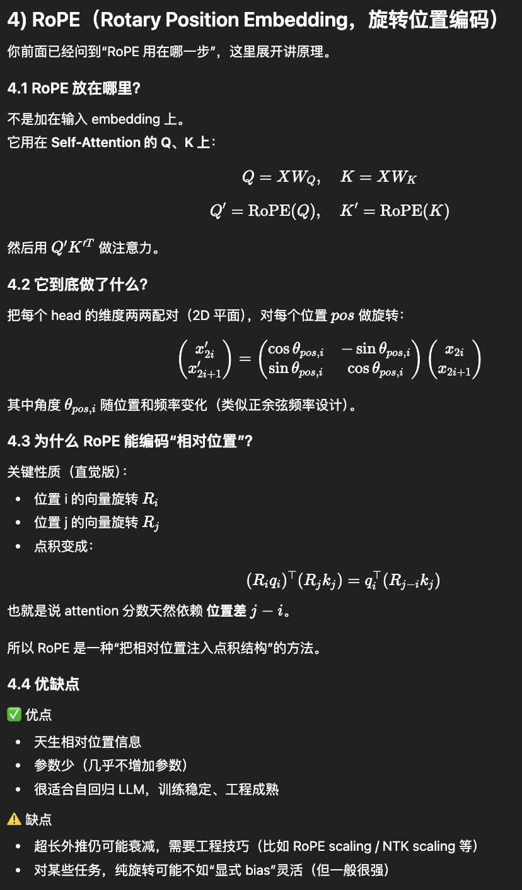
*ps：* 
1. R是旋转矩阵, 作用是：把位置 i 的向量 q_i 在每个 2D 子空间里旋转一个角度 即： $q'_i = R_i q_i$
2. $q'_i = R_i q_i$ 其实等价于：$Q' = \text{RoPE}(Q)$
3. 公式里的 $q_i$ 就是注意力里的 Q 的第 i 个位置向量


| 方法 | 注入位置的方式 | 注入在哪里 | 是否可学习 | 典型使用 |
| -------- | ------------- | ------------------ | ---------------- | -------------- |
| 正余弦 | 固定函数 PE 向量 | 输入处相加 | 完全不可学习 | 原始 Transformer |
| 绝对位置（可学） | 查表参数 (P[pos]) | 输入处相加 | 可学习(L✖️d) | BERT/GPT-2 等   |
| 相对位置 | 距离 bias 或相对向量 | attention score/结构 | 可学习(通常按距离桶,参数通常很小,每个bucket一个数) | T5 等（常见 bias） |
| RoPE | 对 Q/K 做旋转 | Q/K 点积前 | 原始RoPE不可学习 | LLaMA 等现代 LLM  |


## 二. 超参数的设置
### 1. FFN 中 $d_{ff}$ 和 $d_{model}$ 的关系
$$d_{ff} = 4 d_{model}$$
*其中：* 
1. $d_{ff}$ 是 FFN 中隐藏层的维度，即FFN的中间扩展维度。
2. $d_{model}$ 是 Transformer 模型中 token 的隐藏表示维度，同时也是：
    2.1. token embedding 的维度
    2.2. attention 输出的维度
    2.3. residual 连接的维度
    2.4. 整个模型的主通道维度
3. FFN的公式：$\text{FFN}(x) = \max(0, xW_1 + b_1)W_2 + b_2$；FFN做的事情是：$d_{model}$  →  $d_{ff}$  →  $d_{model}$

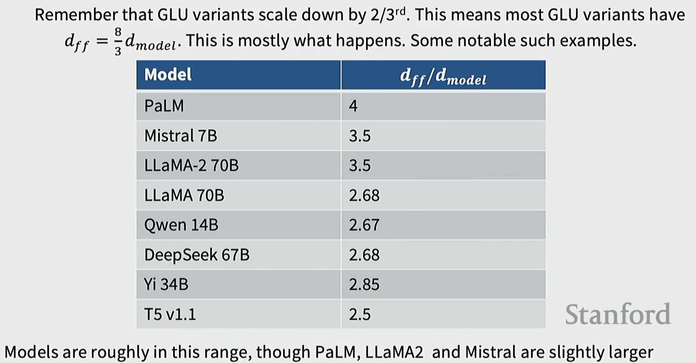
**结论：** 为了在 GLU 结构下保持与传统 4×FFN 相同的参数量，需要把 $d_{ff}$ 从 $4d_{model}$ 缩到 $\frac{8}{3}d_{model}$。 而不使用GLU的模型则继续使用 $d_{ff} = 4d_{model}$ 的设置。
*例外：* F5模型中，$d_{ff} = 65536$ 、 $d_{model} = 1024$

 ### 2. 注意力头数 $n_{heads}$ 和每个头的维度 $d_{head}$ 的关系
 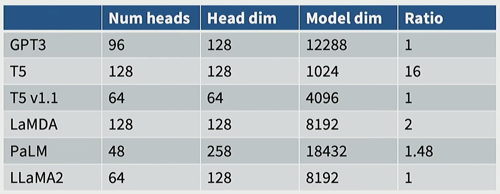
 **结论：** 一般来说，$d_{model} = n_{heads} \times d_{head}$

### 3. 模型的宽长比：$\frac{d_{model}}{n_{layer}}$
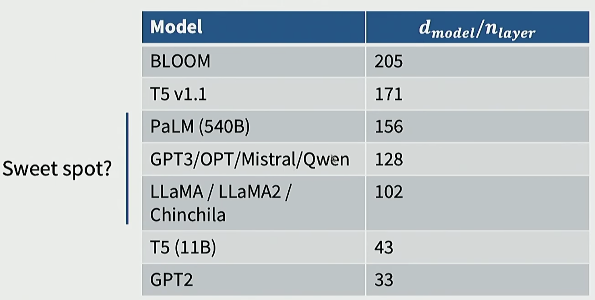
**结论：** 一般选择宽长比 = 128 (100~200之间maybe)

### 4. 词汇表大小的选择
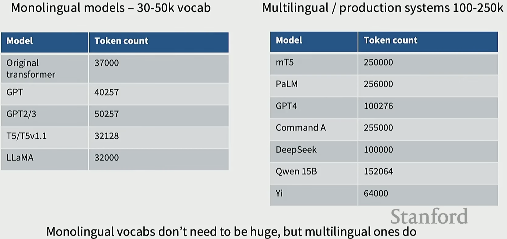
*ps：* 词汇表出现在两个地方：
1. 输入的词嵌入层：Embedding 的维度是V✖️d_model，其中V是词汇表大小。
2. 输出的softmax层：模型最后要在词汇表大小的空间上做 softmax


### 5. dropout和其他正则化设置
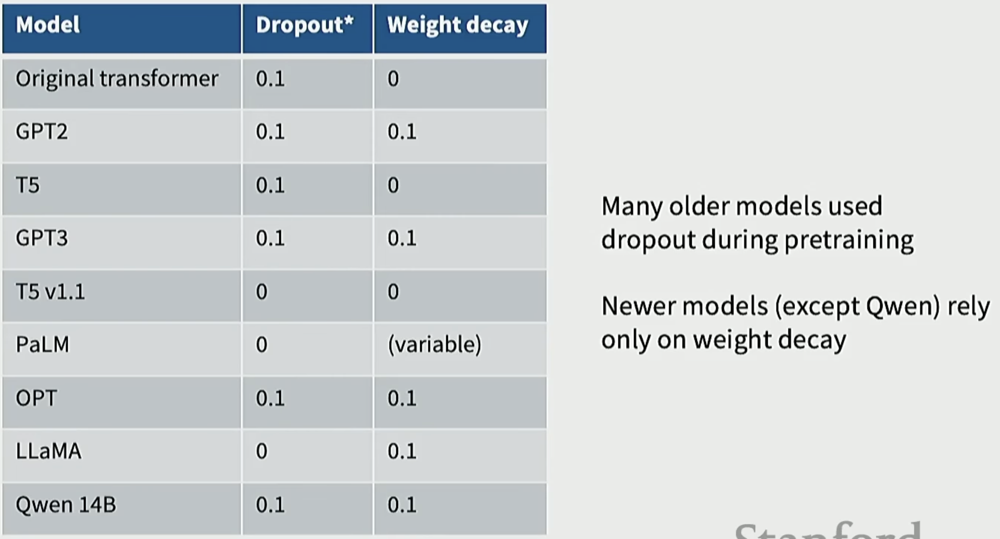
*ps：* 
1. 老模型通常使用dropout，现代大模型则使用权重衰减（weight decay）来进行正则化.
2. 权重衰减并不能直接减少过拟合，而是与学习率相作用来影响模型训练效果，所以使用权重衰减是为了更好的训练效果。 —— quite interesting


### 6. softmax的稳定性
#### (1). z-loss —— 用于稳定输出的softmax层
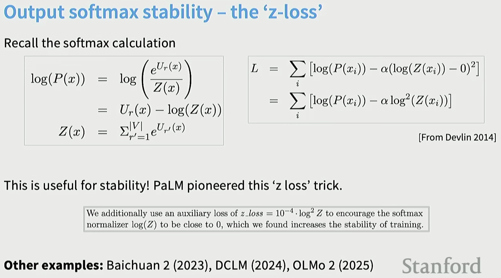
*ps：*
1.  * $U_r(x)$：第 r 个 token 的 logit（未归一化分数）
    * $Z(x)$：softmax 的归一化项
2. z-loss：主要解决的是：**softmax 数值不稳定、logits(未归一化分数) 爆炸的问题**
3. 加上一个额外的辅助损失：L 用于惩罚 log(Z) 偏离 0 (log(Z) 值越小，表示 logits 值越小，表示模型对输入的预测越准确)
#### (2). QK norm —— 用于稳定attention计算的softmax层
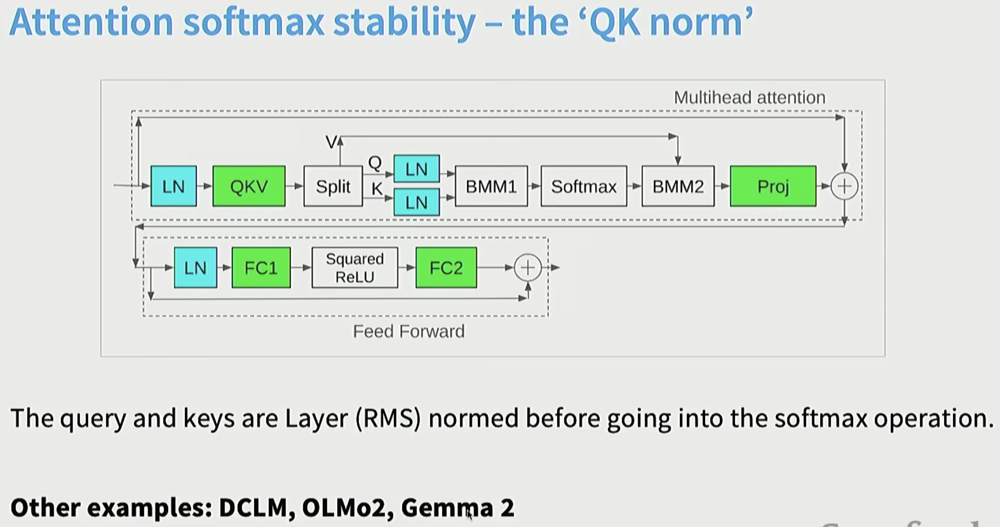
*ps：* 在QK相乘前先对QK进行归一化（LN or RMSNorm），可以稳定softmax的计算，防止数值爆炸.

### 7. GQA 和 MQA —— 相较于MHA的改进: 减小了KV cache的内存占用
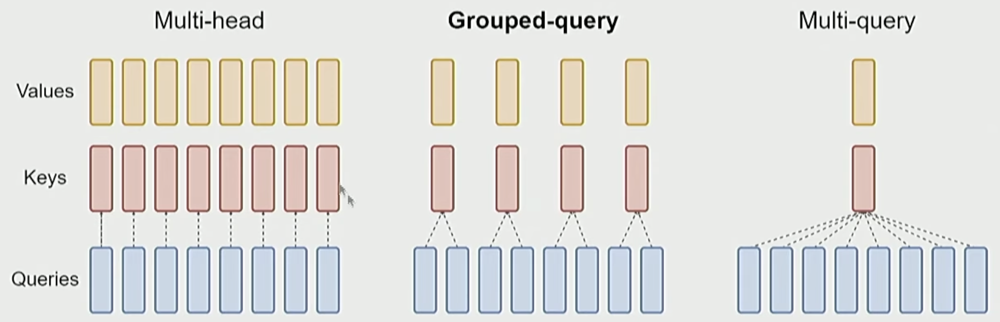
**原因：** MHA 的缺点：推理（尤其自回归生成）时的瓶颈：你要缓存 KV cache，即每层每个 head 的 K,V 对所有历史 token。KV cache 很吃显存和带宽。
**变体：**
1. **MQA —— 多头共享一套 K/V**
    * Q 仍然是多头（每个 head 一个 query）
    * K/V 只有 1 套（所有 head 共享）

*优点：* KV cache 直接减少 H 倍（因为从 H 份 K/V 变 1 份）
*ps：* query的维度为 [batch_size, num_heads, seq_len, head_dim]，key和value的维度为 [batch_size, 1, seq_len, head_dim]。这样就无法直接进行矩阵的乘法，为了完成这一乘法，可以采用**torch的广播乘法**

2. **GQA —— 分组共享 K/V**
    * Q 仍是 H 个头
    * K/V 不是 1 套，而是 分组共享：把 H 个 query heads 分成 G 组，每组共享一套 K/V

*优点：* KV cache 缩小为 H/G 倍（比 MHA 省，但不如 MQA 极致）

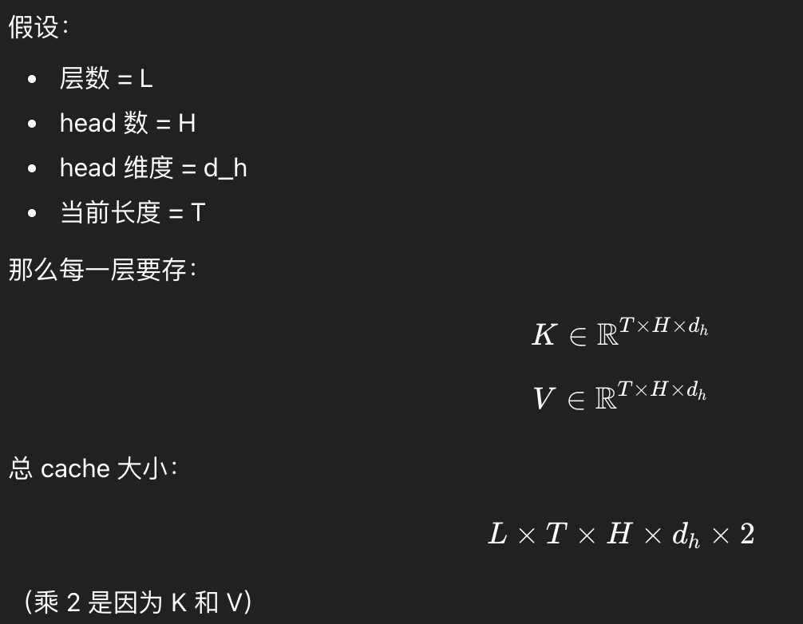
*ps：* KV cache 就是把每一层每个 token 的 K 和 V 存起来

## 三. 其他变体 —— 仅提到
1. 稀疏/滑动窗口注意力机制
2. RoPE + SWA


# 第四个视频 —— MoEs


